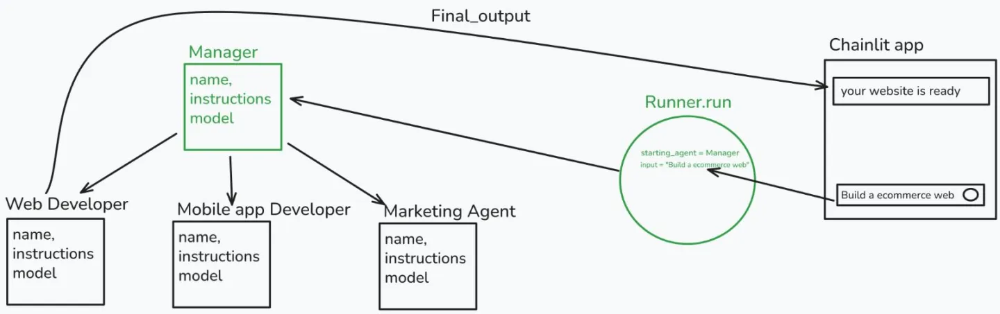
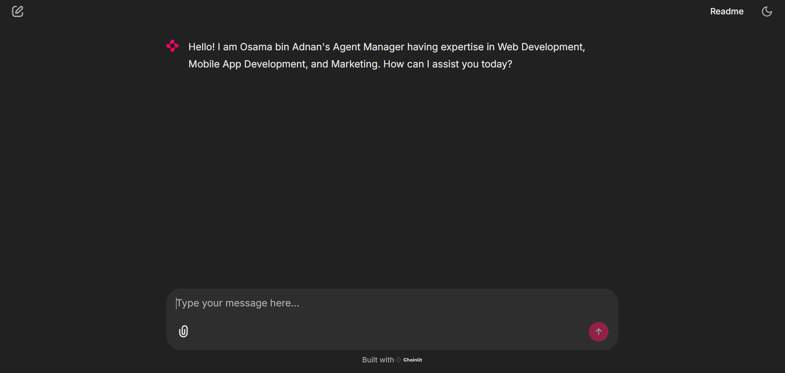
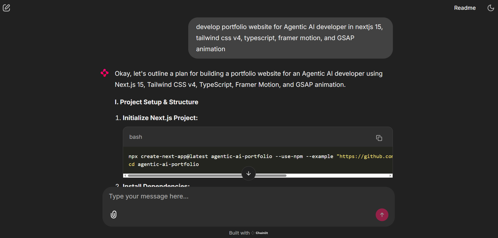
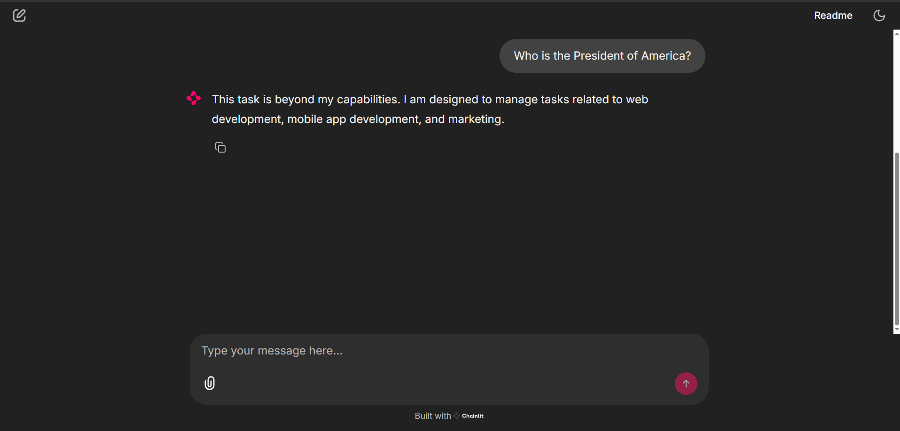

# AI Agent Manager with Specialized Agents

This project implements an AI Agent Manager system using Chainlit and Python, featuring specialized agents for Web Development, Mobile App Development, and Marketing tasks.

## Class Assignment Overview



## Features

- **Multi-Agent System**: Coordinates between specialized agents for different domains
- **Real-time Chat Interface**: Built with Chainlit for smooth interaction
- **Specialized Expertise**:
  - Web Development Agent
  - Mobile App Development Agent
  - Marketing Agent

## Example Interactions

### Interface Overview


### Relevant Questions


### Unrelevant Questions



## Project Structure

```
├── main.py           # Main application entry point
├── chatbot.py        # Agent implementation and configuration
├── chainlit.md       # Chainlit configuration
├── pyproject.toml    # Project dependencies and settings
└── Assets/          # Project images and resources
```

## System Architecture

The system consists of several key components:

1. **Manager Agent**: Coordinates and delegates tasks to specialized agents
2. **Specialized Agents**:
   - **Web Development Agent**: Handles website development tasks using modern frameworks
   - **Mobile App Development Agent**: Manages mobile app development inquiries
   - **Marketing Agent**: Handles digital marketing strategies and content

## Getting Started

1. Install dependencies:
   ```bash
   pip install -r requirements.txt
   ```

2. Set up environment variables:
   - Create a `.env` file
   - Add your Gemini API key:
     ```
     GEMINI_API_KEY=your_api_key_here
     ```

3. Run the application:
   ```bash
   chainlit run main.py
   ```

## Technical Details

- **Framework**: Chainlit for chat interface
- **AI Model**: Gemini 2.0 Flash
- **Architecture**: Asynchronous agent-based system
- **Configuration**: Environment-based setup with dotenv

## Features Breakdown

### Manager Agent
- Task analysis and delegation
- Coordination between specialized agents
- Quality oversight and workflow management

### Web Development Agent
- Modern framework expertise (Next.js, Vue 3, SvelteKit)
- Responsive design implementation
- Performance optimization
- Accessibility compliance

### Mobile App Development Agent
- Cross-platform development (React Native, Flutter)
- UI/UX optimization
- Platform-specific guideline adherence
- Performance optimization

### Marketing Agent
- Digital marketing strategy development
- Content creation and optimization
- Data-driven campaign management
- Multi-platform marketing expertise

## Contributing

Feel free to contribute to this project by submitting issues or pull requests.

## License

This project is licensed under the MIT License.

## Author

Created by Osama bin Adnan 💗
