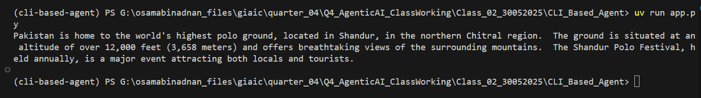

# CLI Based Agent

A Python-based CLI agent that uses Google's Gemini model through an OpenAI-compatible API interface to create an interactive chatbot.

## Features

- Integrates with Google's Gemini 1.5 Flash model
- Uses OpenAI-compatible API interface
- Implements async operations for better performance
- Environment-based configuration
- Simple and extensible architecture

## Prerequisites

- Python 3.13 or higher
- Google Gemini API key
- UV Package Manager (Modern Python Package Manager)

## Installation

1. Clone the repository

2. Install UV package manager if you haven't already:
```bash
curl -LsSf https://astral.sh/uv/install.ps1 | pwsh
```

3. Create a virtual environment and install dependencies:
```bash
uv venv
.venv/Scripts/activate
uv pip install -e .
```

Note: UV provides faster package installation and better dependency resolution compared to traditional pip.

## Configuration

1. Create a `.env` file in the root directory
2. Add your Gemini API key:
```
GEMINI_API_KEY=your_api_key_here
```

## Usage

Run the application using:
```bash
python app.py
```

### Example Output

Below is an example of the CLI agent in action:



## Project Structure

```
├── app.py                 # Main application file
├── pyproject.toml         # Project configuration
├── README.md             # Project documentation
├── uv.lock               # Dependency lock file
├── assets/               # Project assets
│   └── image.png        # CLI output image
└── src/                  # Source code
    └── cli_based_agent/  # Main package
        └── __init__.py   # Package entry point
```

## Dependencies

- openai-agents >= 0.0.16
- python-dotenv >= 1.1.0

## Development

This project uses modern Python features and follows best practices for code organization and documentation.

## Author

OsamabinAdnan (binadnanosama@gmail.com)

## License

This project is proprietary and confidential.